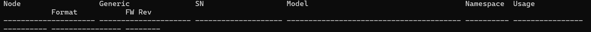

# Cybersecurity Home Lab: Splunk Monitoring & Linux Security

## Overview
This project demonstrates the deployment of a security monitoring environment. I built this lab to practice real-time threat detection, log analysis, and infrastructure hardening.

## Technical Stack
* **SIEM:** Splunk Enterprise
* **OS:** Ubuntu Server / Debian
* **Protocols monitored:** SSH, HTTP, NVMe-over-TCP
* **Tools:** Nmap (vulnerability scanning), UFW (Firewalling)

## Lab Architecture & Dashboard
 

 

### Key Features:
1. **Brute-Force Detection:** Custom Splunk alerts for multiple failed SSH login attempts.
2. **Network Observability:** Monitoring traffic and performance for storage protocols (NVMe-over-TCP).
3. **Log Aggregation:** Centralizing logs from multiple Linux endpoints using Splunk Forwarders.

## What I Learned
* How to configure Splunk data inputs and manage indexes.
* Identifying suspicious patterns in Syslog and Auth.log.
* Hardening Linux servers by managing ports and firewall rules.
