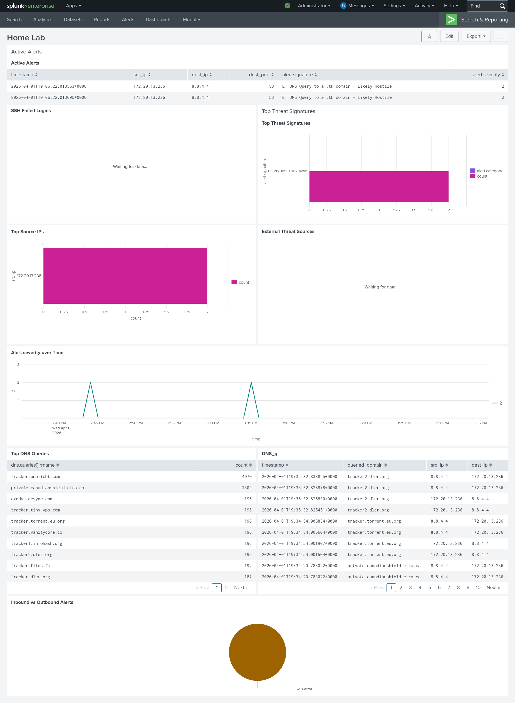
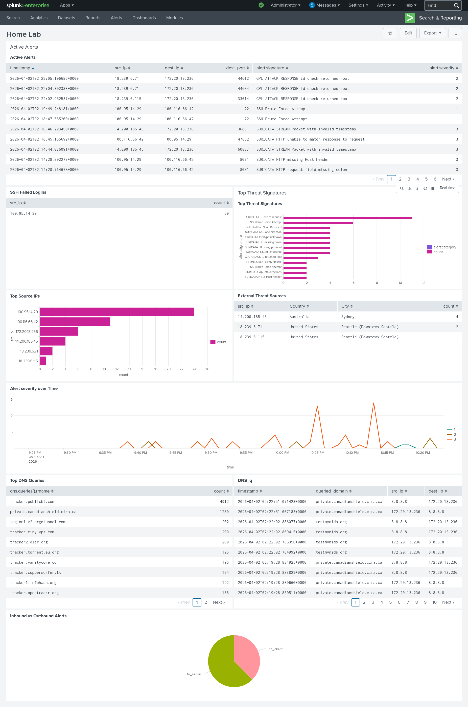
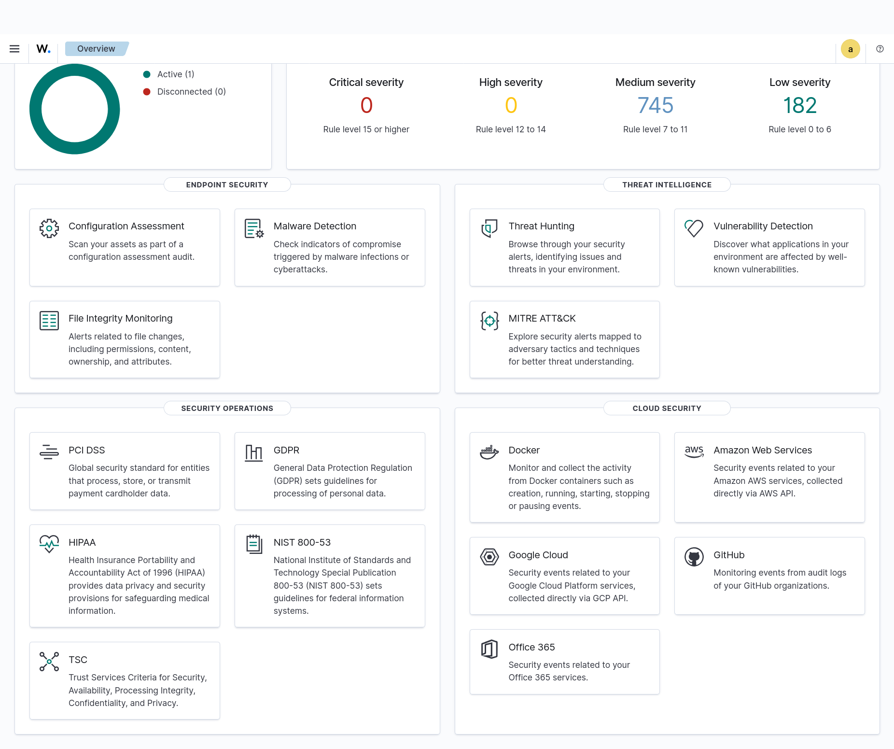
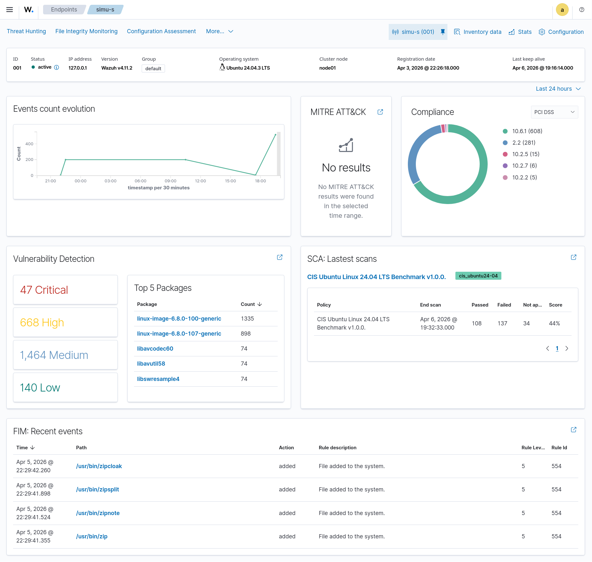
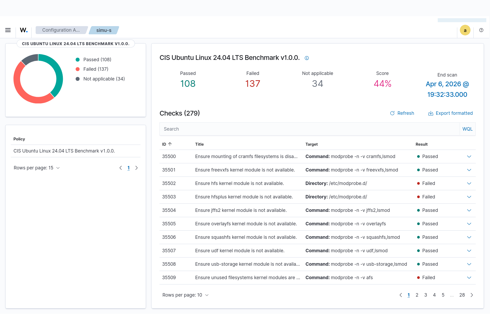

# Cybersecurity Home Lab: SOC Monitoring Pipeline

A personal cybersecurity lab simulating a Security Operations Center (SOC) environment. Built to practice real-world threat detection, incident response, and log analysis using industry-standard tools.

This project has evolved over several months — starting with basic Splunk log aggregation on a virtual machine, and growing into a full detection pipeline on a dedicated physical server with a network IDS, EDR, containerized services, secure remote access, and documented incident response.

---

## Architecture

```
[Network Traffic]
       │
       ▼
[Suricata IDS] ──── eve.json ────▶ [Splunk Universal Forwarder (Docker)]
       │                                        │
[/var/log/auth.log] ─────────────────────────▶ │
                                                ▼
                                      [Splunk Enterprise]
                                                │
                                                ▼
                                      [SOC Dashboard]
                                    (Alerts, DNS, GeoIP,
                                     SSH Brute Force,
                                     Threat Signatures)

[Wazuh Agent] ──── ossec events ──▶ [Wazuh Single-Node Stack (Docker)]
       │                               ├── wazuh.manager
       │                               ├── wazuh.indexer
       └─── both on Ubuntu Server ─────┴── wazuh.dashboard
            simu-s                                  │
                                                    ▼
                                          [Wazuh Dashboard]
                                        (FIM, SCA, Vulnerability
                                         Detection, Agent Status)
```

> **Note:** Wazuh is deployed as the official single-node Docker Compose stack — Manager, Indexer, and Dashboard run as three containers on Ubuntu Server (`simu-s`). The Wazuh Agent is installed natively on the same host and connects to the Manager via `127.0.0.1:1514`. The dashboard is accessed remotely via Tailscale VPN on port 8443.

Remote Access: Tailscale VPN connects all lab nodes securely without exposing ports to the internet.

---

## Technical Stack

| Component | Tool | Purpose |
|-----------|------|---------|
| SIEM | Splunk Enterprise | Log aggregation, dashboards, alerting |
| IDS | Suricata 8.0.3 | Network intrusion detection |
| EDR / HIDS | Wazuh 4.11.2 | Endpoint detection, FIM, SCA, vulnerability scanning |
| Log Forwarder | Splunk Universal Forwarder (Docker) | Ships logs to Splunk |
| EDR Manager | Wazuh Single-Node Stack (Docker) | Manager + Indexer + Dashboard — receives agent telemetry, runs detections |
| EDR Agent | Wazuh Agent v4.11.2 (native) | Ships endpoint telemetry to local Manager |
| Containerization | Docker / Portainer | Runs Suricata, UF, and Wazuh stack as containers |
| Remote Access | Tailscale | Secure site-to-site VPN across lab nodes |
| OS | Ubuntu Server 24.04 | Primary dedicated lab host |
| Firewall | UFW | Host-based firewall hardening |
| Storage Protocol | NVMe-over-TCP | Storage network monitoring (v1) |

---

## Lab Evolution

### v1 — Basic Splunk Monitoring (January 2026)

- Deployed Splunk Enterprise and Universal Forwarder on a virtual machine
- Ingested syslog and auth.log from Linux endpoints
- Built brute-force detection for SSH failed logins
- Monitored NVMe-over-TCP storage protocol traffic
- Hardened server with UFW firewall rules

### v2 — Full SOC Pipeline on Dedicated Server (March 2026)

- Migrated from VM to dedicated physical server
- Deployed Suricata IDS 8.0.3 in Docker container
- Configured eve.json log forwarding to Splunk Enterprise via Universal Forwarder
- Tuned Suricata configuration to eliminate noise (mdns, fileinfo, stats)
- Built suppression rules in threshold.conf for known benign signatures
- Built 8-panel real-time SOC dashboard in Splunk
- Written custom Suricata detection rule for SSH brute force (SID 9000001)
- Documented first real incidents (INC-001, INC-002)

### v3 — EDR Integration (April 2026)

- Deployed Wazuh as official single-node Docker Compose stack (Manager + Indexer + Dashboard) on Ubuntu Server
- Deployed Wazuh Agent natively on the same Ubuntu Server to monitor the host itself
- Agent connects to Manager via localhost (127.0.0.1:1514) — both on simu-s
- Resolved version mismatch — downgraded Wazuh Agent to v4.11.2 to match Manager
- Enabled File Integrity Monitoring — tracking changes across /etc, /usr/bin, /usr/sbin
- Enabled Vulnerability Detection — identified 47 Critical, 956 High CVEs on monitored host
- Resolved missing SCA policy — downloaded CIS Ubuntu 24.04 benchmark from Wazuh main branch
- Ran Security Configuration Assessment — scored 44% (108 passed / 137 failed controls)
- Lab now covers both network-layer detection (Suricata) and host-layer detection (Wazuh)

---

## SOC Dashboard

The Splunk dashboard provides real-time visibility across 8 panels:

| Panel | Query Focus | Visualization |
|-------|-------------|---------------|
| Active Alerts | Suricata alerts filtered for real threats | Statistics Table |
| Top Threat Signatures | Most triggered detection rules | Bar Chart |
| Top Source IPs | External IPs generating alerts | Bar Chart |
| SSH Failed Logins | Brute force attempts from auth.log | Statistics Table |
| Alert Severity Over Time | Alert trends by severity | Line Chart |
| DNS Feed | Live DNS queries ordered by time | Statistics Table |
| Inbound vs Outbound | Alert directionality | Pie Chart |
| External Threat Sources | GeoIP enrichment of alert sources | Statistics Table |

### Baseline Dashboard



### Dashboard During Simulated Attack



---

## Wazuh EDR Dashboard

### Overview — 1 Active Agent, 406 Medium Alerts



### Agent Detail — simu-s (Ubuntu 24.04, Wazuh v4.11.2)



### SCA Check Details — 137 Failed Controls



---

## Detections & Simulations

### Real Detections

**BitTorrent Tracker Communication**
Suricata detected DNS queries from internal host 172.20.13.236 to known BitTorrent tracker tracker.coppersurfer.tk. In a corporate environment this would constitute a policy violation and potential data exfiltration risk. Documented as INC-001.

**SSDP Scanning**
Recurring UDP traffic to port 1900 (SSDP) detected from internal host to router. Identified as benign network discovery, suppressed via threshold.conf.

**CIS Benchmark Failures — 137 Failed Controls**
Wazuh SCA scan against CIS Ubuntu 24.04 LTS Benchmark v1.0.0 identified 137 failed security controls, scoring 44%. Key failures include unused kernel modules loaded, missing audit rules, and unhardened SSH configuration. Represents a full remediation roadmap for server hardening.

### Simulated Attacks

**GPL ATTACK_RESPONSE — testmynids.org**
```bash
curl http://testmynids.org/uid/index.html
```
Triggered signature `GPL ATTACK_RESPONSE id check returned root` (SID 2100498), severity 2. Alert visible in Splunk within seconds of execution. Validates end-to-end pipeline: traffic → Suricata → eve.json → UF → Splunk → dashboard.

**SSH Brute Force**
```bash
for i in {1..20}; do ssh fakeuser@<target-ip>; done
```
Generated 20 failed authentication attempts. Detected in auth.log, visible in SSH Failed Logins panel. Source IP 100.119.163.101 (Tailscale node) identified as attacker. Also triggered custom Suricata rule SID 9000001.

**Nmap Port Scan**
```bash
nmap -sS <target-ip>
nmap -sV <target-ip>
```
SYN and version scans triggered Suricata HTTP anomaly rules. Alerts visible in Active Alerts panel with `in_iface: tailscale0`.

---

## SPL Queries

All dashboard queries are documented in `splunk-queries/dashboard-queries.md`.

Key queries:

**Active Alerts (filtered)**
```spl
sourcetype=suricata event_type=alert NOT dest_port=1900
NOT alert.signature="SURICATA Ethertype unknown"
| table timestamp src_ip dest_ip dest_port alert.signature alert.severity in_iface
| sort -timestamp
```

**SSH Brute Force Detection**
```spl
sourcetype=linux_secure ("Failed password" OR "Invalid user")
| rex field=_raw "from (?P<src_ip>\d+\.\d+\.\d+\.\d+)"
| stats count by src_ip
| sort -count
```

**GeoIP Enrichment**
```spl
sourcetype=suricata event_type=alert NOT dest_port=1900
| iplocation src_ip
| stats count by src_ip Country City
| sort -count
```

**Suspicious DNS (rare domains)**
```spl
sourcetype=suricata event_type=dns
| spath input=_raw path="dns.queries{0}.rrname" output=queried_domain
| stats count by queried_domain
| where count < 5
| sort -count
```

---

## Suricata Configuration

Suricata was tuned to log only security-relevant event types, eliminating noise while retaining full threat visibility:

**Enabled:** alert, anomaly, http, tls, dns, dhcp, ssh

**Disabled:** mdns, files, smtp, fileinfo, stats, ftp, rdp, nfs, smb, websocket, and 10+ other low-value protocol loggers

Full config: `config/suricata.yaml`
Suppression rules: `config/threshold.conf`

---

## Incidents

| ID | Date | Title | Severity |
|----|------|-------|----------|
| INC-001 | 2026-03-31 | BitTorrent Tracker Communication Detected | Medium |
| INC-002 | 2026-04-02 | GPL ATTACK_RESPONSE id check | High |

---

## What I Learned

### v1
- Configuring Splunk data inputs and managing indexes
- Identifying suspicious patterns in syslog and auth.log
- Hardening Linux servers with UFW firewall rules
- Monitoring storage network protocols (NVMe-over-TCP)

### v2
- Deploying and tuning a network IDS (Suricata) in a Docker environment
- Configuring eve.json output and forwarding to a SIEM
- Reducing alert noise through suricata.yaml tuning and threshold.conf suppression rules
- Building multi-panel real-time SOC dashboards in Splunk
- Writing SPL queries for threat detection and GeoIP enrichment
- Writing custom Suricata detection rules (SSH brute force, SID 9000001)
- Documenting incidents using an incident handler's journal format
- Understanding the difference between raw telemetry and actionable alerts
- Simulating real attacks (brute force, port scan, C2 callbacks) to validate detection pipeline

### v3
- Deploying a full EDR stack (Manager + Indexer + Dashboard) using Docker Compose on the same host as the monitored endpoint
- Configuring Wazuh Agent to connect to a local Manager via localhost (127.0.0.1)
- Diagnosing and resolving version compatibility issues between Wazuh Agent and Manager
- Understanding the difference between network-based detection (IDS) and host-based detection (EDR/HIDS)
- Configuring File Integrity Monitoring (FIM) to track critical system paths
- Running a CIS benchmark audit (SCA) and interpreting pass/fail results
- Identifying and documenting vulnerability findings from automated scans
- Sourcing and deploying missing SCA policy files for newer OS versions

---

## Repository Structure

```
Homelab/
├── README.md
├── screenshots/
│   ├── dashboard-baseline.png
│   ├── dashboard-attack-simulation.png
│   ├── wazuh-overview.png
│   ├── wazuh-agent-simu-s.png
│   ├── wazuh-sca-score.png
│   └── wazuh-sca-details.png
├── config/
│   ├── suricata.yaml
│   └── threshold.conf
├── splunk-queries/
│   └── dashboard-queries.md
├── wazuh/
│   └── setup-notes.md
└── incidents/
    ├── INC-001-bittorrent-detection.md
    └── INC-002-attack-response-root.md
```
